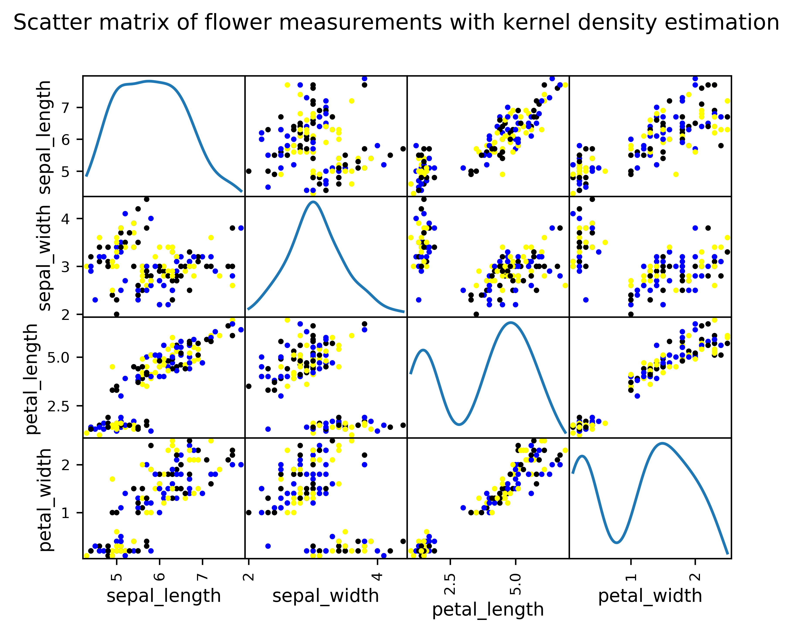

# Iris Data Project
Programming and Scripting module - Project on the Iris dataset

*By: Mohamed Noor - April 2018*

___
## Table of Contents
* [Introduction](#intro)
* [Methods](#methods)
* [Results and Discussion](#results)
* [Conclusion](#conclusion)
* [Appendix 1: Usage instructions](#app1-usage)
* [Appendix 2: Repository structure](#app2-repo_structure)

___
## Introduction <a id="intro"></a>
This project is related to the Fisher's Iris dataset, as obtained from the [UCI Machine Learning Repository](https://archive.ics.uci.edu/ml/datasets/iris)<a href="inputs/UCI Machine Learning Repository_ Iris Data Set.pdf"> (webpage snapshot)</a>.

To analyze the dataset (in statistics term: exploratory data analysis), a script was written in Python 3.6.3 with Visual Studio Community 2017. The main and other well-known libraries were utilized to read the Iris dataset and output the analysis results.
(see the following section below).

An extensive search was made on [stackoverflow](https://stackoverflow.com/), [Python documentation](https://docs.python.org/3/) and Google in general to determine the best strategy for writing a relatively flexible, OS-independent script.

Briefly, in terms of the *Iris* dataset itself, the dataset captures the measurements of *Iris* flowers (sepal and petal lengths and widths, all in cm) and the respective *Iris* species (*I. setosa*, *I. versicolor* and *I. virginica*), and was used by Ronald Fisher in his [paper (R.A. Fisher (1936) 'The use of multiple measurements in taxonomic problems', Annals of Eugenics, 7: 179-188. doi:10.1111/j.1469-1809.1936.tb02137.x](https://doi.org/10.1111%2Fj.1469-1809.1936.tb02137.x). Incidentally, note that the journal's name was changed to Annals of Human Genetics for bad connotations of the eugenics field. There is also more information about the dataset on [Wikipedia](https://en.wikipedia.org/wiki/Iris_flower_data_set).

In the machine learning field, this dataset can be used to train different statistical algorithms and perform a prediction on which species a set of flower measurements belong to.

Some images to give a background are in the table below - all images were taken from/linked to the [Wikipedia page](https://en.wikipedia.org/wiki/Iris_flower_data_set), and are confirmed to be freely shareable.


|R. A. Fisher <br>    | *Iris setosa* <br>  |
|:---:|:---:|
|***Iris versicolor*** <br>   | ***Iris virginica*** <br> |

For those of us not well-versed in flowers, the image below shows the sepal and petal, as linked to [University of Maryland Math Department](https://www.math.umd.edu/~petersd/666/html/iris_pca.html):


<p align="center">

</p>


## Methods <a id="methods"></a>

### Rationale for chosen method
Among the options considered for designing the project solution was:

1. a graphical user interface whereby users can load their desired dataset and the plots will be displayed within the window. Not pursued because of requirements of installation of `wxPython` library and total time to run.

2. a web-based interface with `Plotly`. Not pursued due to the relative complexity in laying out the code in MVC model, and the code in Python is converted to HTML/JavaScript anyway. If there is no language restriction, writing the code in JavaScript would be the most straightforward option.

3. a simple, commandline interface with no user options except for letting users to choose the specific dataset. All outputs are automatically saved to the user's root drive under a subfolder named according to the current time. This was the approach taken in this project.

The imported libraries are:
1. `pandas` - provides easy manipulation of datasets (dataframes) and obtain descriptive statistical information

2. `matplotlib.pyplot` - generate graphical plots. Note that pandas already call matplotlib implicitly for plotting, although using this library allows for more finetuning than from `pandas`

3. `tkinter` - provides access to the OS open file dialog box

4. `os, sys, pathlib` - to obtain root drive and perform directory operations in an OS-independent way (*the Python way*)

5. `datetime` - to allow reading current date and time. Only used to generate a name for a folder to save outputs to

### Description of script execution
The script performs certain tasks in a logical way as detailed below:
1. Ask user for the location of the *Iris* dataset using `tkinter` dialog. In case the user clicks 'Cancel' in the dialog, the script exits without running the rest of the code.
2. The actual reading of the csv file is done by `pandas` into a dataframe (df). Following this, multiple statistics can be conveniently obtained including the mean, standard deviation and overall data distribution. The correlation between each of the *Iris* flower measurements are also performed. Information on the various methods to calculate pairwise correlation was obtained from [Statistics Solutions](https://www.statisticssolutions.com/correlation-pearson-kendall-spearman/) and [Minitab Support](http://support.minitab.com/en-us/minitab-express/1/help-and-how-to/modeling-statistics/regression/supporting-topics/basics/a-comparison-of-the-pearson-and-spearman-correlation-methods/).

* In general:
  * Pearson (default): assumes linearity, normal distribution and homoscedasticity (data equally distributed about the regression line
  * Kendall: does not seem to be apply here because there is no ranking
  * Spearman: non-parametric, no assumption about data distribution. Indicates monotonic relationship (i.e.  rate of change that is not necessarily constant.
  * A (Spearman correlation > P correlation) value indicate a monotonic, non-linear relationship
  * Most non-parametric tests in statistics are less powerful than the equivalent parametric tests.

3. `os` and `sys` libraries are called together with `datetime` to make a string containing the root folder and current date and time, so that `pathlib.mkdir` can be invoked to make a folder to save the output files (e.g. C:\20180402_1424). For confirmation, this path is also printed out to the screen so that the user knows the exact path (instead of searching the whole disk).

4. A second string, containing the descriptive statistics calculated by `pandas`, is then constructed and written into a file called [iris_data_summary.txt](outputs/iris_data_summary.txt).

5. Since four plots are generated at 600 dpi resolution (typical resolution for publication), there can be some lag until files are actually written. Therefore, an update on the script status is printed out first and then updated again after saving. 

## Results and Discussion <a id="results"></a>

At a quick glance at [iris_data_summary.txt](outputs/iris_data_summary.txt), we can see that there are no missing values (150 measurements in total). In addition, petal length displays a high variance - which is further confirmed by the corresponding boxplot. Therefore, petal length could be a really useful variable for species discrimination compared to the other variables. Note that descriptive (textual) statistics are actually better represented by boxplots - after all, a picture is worth a thousand words!

**Table 1. Dataset description (rounded to one decimal place here in keeping with the measurements and for presentation purposes)**

|value |sepal_length|sepal_width|petal_length|petal_width|
|--|:--:|:--:|:--:|:--:|
|count|150|150|150|150|
|mean|5.8|3.1|3.8|1.2|
|standard deviation|0.8|0.4|1.8|0.8|
|min|4.3|2.0|1.0|0.1|
|25 %|5.1|2.8|1.6|0.3|
|50 %|5.8|3.0|4.4|1.3|
|75 %|6.4|3.3|5.1|1.8|
|max|7.9|4.4|6.9|2.5|


**Table 2. Pearson product moment correlation for the four flower variables**

| |sepal_length|sepal_width|petal_length|petal_width|
|--|:--:|:--:|:--:|:--:|
|sepal_length|1.000000|-0.109369|0.871754|0.817954|
|sepal_width|-0.109369|1.000000|-0.420516|-0.356544|
|petal_length|0.871754|-0.420516|1.000000|0.962757|
|petal_width|0.817954|-0.356544|0.962757|1.000000|


**Table 3. Spearman rank correlation for the four flower variables**

| |sepal_length|sepal_width|petal_length|petal_width|
|--|:--:|:--:|:--:|:--:|
|sepal_length|1.000000|-0.159457|0.881386|0.834421|
|sepal_width|-0.159457|1.000000|-0.303421|-0.277511|
|petal_length|0.881386|-0.303421|1.000000|0.936003|
|petal_width|0.834421|-0.277511|0.936003|1.000000|


The plots generated by the script (at 600 dpi as per typical journal publication requirements) and their interpretation are as follows:

* [fig1.png](outputs/fig1.png) - a combination of boxplots that provides a visual summary of measurement distribution grouped by the *Iris* species. Some observations that can be made are:
  * the petal dimensions of *I. setosa* are smaller than the other two species. The corresponding dataset is also quite tightly clustered, especially given the significantly wider distribution of *I. versicolor* and *I. virginica* petal length.
  * most of the dataset grouped by species do not perfectly follow a normal distribution (except for *I. setosa* sepal dimensions).
  * some of the datapoints are actually outliers more than 1.5 of the respective inter-quatile range (1.5 x IQR). These could be caused by either actual natural distribution, or by error in classification.

<p align="center">

</p>

__Figure 1. Boxplots of flower measurements.__


* [fig2.png](outputs/fig2.png) - a scatter matrix for pairwise multivariate analysis to determine relationship between each of the measurements. This augments the pairwise correlation calculated in [iris_data_summary.txt](outputs/iris_data_summary.txt). The suspicion that the datapoints are not normally distributed (above) is confirmed in the scatter matrix kde (kernel density estimation). We can see that there is a bimodal distribution for petal dimensions, whereas the sepal width is normally distributed. We can also see there is a linear relationship between sepal length and petal length, sepal length and petal width, and petal length and petal width. From the [iris_data_summary.txt](outputs/iris_data_summary.txt), the corresponding Pearson and Spearman correlations are 0.87/0.88, 0.82/0.83, and 0.96/0.94. The others display poor correlations of < 0.5.



<p align="center">

</p>

500px x 399.42291838417

__Figure 2. A pairwise comparison of the relationship between the flower measurements.__


* [fig3.png](outputs/fig3.png) - a parallel coordinates plot as an orthogonal method for multivariate analysis, grouped by species. From the plot, it is clear that the petal length of *I. setosa* is distinct from the other two species. This can be used as the first step to distinguish the species. In contrast, the sepal length is not a useful discriminant criterion as there is a significant overlap among the species. To distinguish between *I. versicolor* and *I. virginica*, it is possible to use petal length and petal width as (collectively) the petal dimensions of *I. virginica* are larger than *I. versicolor*.


__Figure 3. A parallel coordinates plot indicating the clustering of flower dimensions for each species.__


* [fig4.png](outputs/fig4.png) - a lag plot to examine whether the datasets display a specific structure. If the measurements are truly by nature (not genetics), then the *Iris* dataset should be random, which is not the case with the dataset. Therefore, the petal and sepal dimensions are very likely (as usual) to be determined by genetic components. For comparison, a random structure is shown below the Iris lag plot, taken from the [Pandas Plotting blog](http://pandasplotting.blogspot.com/2012/06/lag-plot.html):


__Figure 4. (Top) The *Iris* dataset as a whole is not random, indicating another factor in play, possible genetics. (Bottom) A lag plot representation of random white noise where the datapoints are truly random. Figure taken from the Pandas Plotting blog.__


## Conclusion <a id="conclusion"></a>

The *Iris* dataset is easy to work with, as there are no missing values or unusual data structures. Based on the output tables and figures, the datapoints are not normally distributed except for the sepal width when considering all the species together. The parallel coordinates plot also leads to a clear method to discrimate the species, whereby *I. setosa* flowers have their own petal dimension cluster (1-2 cm for length and 0.1-0.8 cm for width). The other two species have a slight overlap in their petal dimensions, although *I. versicolor* petal length is mostly about 3-5 cm and width is 1-2 cm, and *I. virginica* is about 4.5-7 cm (length) and 1.5-2.5 cm.

If required, this Python script can be easily modified for other datasets, allowing for a higher code reusability.

## Appendix 1: Usage instructions <a id="app1-usage"></a>

[The script](IrisData_project.py) relies on the `pandas`, `matplotlib` and `tkinter` libraries for calculating the statistical values and for plotting graphs, and therefore these libraries must be installed prior to running the script. If not, the following error will occur:

```
Traceback (most recent call last):
  File "<stdin>", line 1, in <module>
ModuleNotFoundError: No module named 'xxxx'
```
To run the script, open up a shell and just type `python IrisData_project.py`.
An open file dialog box will then appear - choose an Iris data file in .csv format.
The three tables (Tables 1-3) displayed in the Results and Discussion section will be printed to screen and saved to a file named iris_data_summary.txt.
Following this, the Figures 1-4 will be generated and saved as well.
The outputs will all be saved on the root drive (in Windows, usually C:\) to a folder named based on the current date (YYYYMMDD) and time (HHMM) - *e.g.* C:\20180402_1424. This assures a unique location each time the script is run, provided there is no time change (*e.g.* summer time).


## Appendix 2: Repository structure <a id="app2-repo_structure"></a>

This repository is structured as follows:
1. [Python script](IrisData_project.py) - a Python 3.6 script to automatically process the *Iris* dataset.
2. [Project description](README.md) - this file, a text file (Markdown) containing project background and description of the script.
3. [Input folder](inputs) - contains the [*Iris* dataset](inputs/iris.data) and a snapshot of the data source [UCI Machine Learning Repository_ Iris Data Set.pdf](inputs/UCI Machine Learning Repository_ Iris Data Set.pdf).
4. [Output folder](outputs) - contains the standard outputs of the script as described in detail in the Results and Discussion section above.
* 	[fig1.png](outputs/fig1.png) - boxplot
*	[fig2.png](outputs/fig2.png) - scatter matrix
*	[fig3.png](outputs/fig3.png) - parallel coordinates plot
*	[fig4.png](outputs/fig4.png) - lag plot
*	[iris_data_summary.txt](outputs/iris_data_summary.txt) - text file summarizing the dataset with correlation coefficients

___
############## END OF FILE ##############
